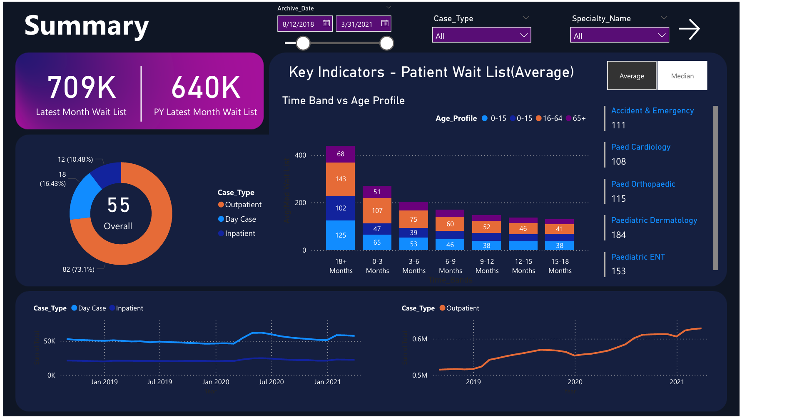
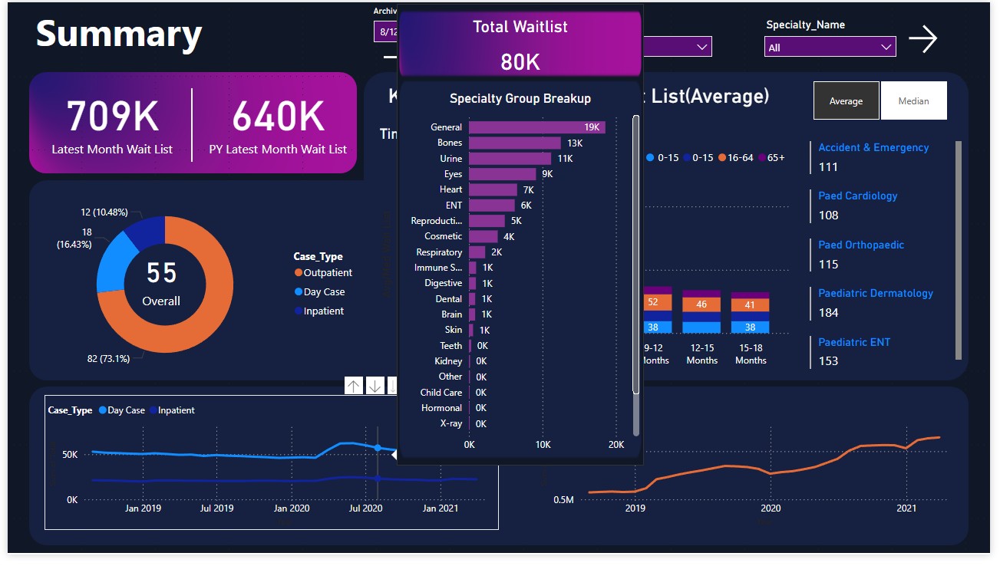

# Healthcare Data - Patient Wait List Dashboard
This project is a Power BI portfolio project showcasing healthcare-related data visualization and reporting.
It demonstrates my ability to clean, transform, and analyze data, as well as design clear and insightful dashboards.

## ⚙️ Tools & Skills Used
- Power BI Desktop
- Data Modeling
- DAX for calculated columns and measures
- Data Cleaning & Transformation with Power Query
- Interactive Dashboards (filters, slicers, drill-throughs)

## 📊 Datasets
- The datasets used in this project contain real, publicly available healthcare data (non-sensitive, anonymized).
- The data analyzed covers the years **2018, 2019, 2020, and 2021**.
- The datasets are located in the **Inpatient** and **Outpatient** folders respectively.
- The data is **divided into two tables per year** depending on the patient case type — **Inpatient** or **Outpatient**.
- **Inpatient**: A patient that stays in a hospital while under treatment.
- **Outpatient**: A patient who receives medical treatment without being admitted to the hospital.
- **Day Case**: Also analyzed in the project. This is an Inpatient case that stayed in a hospital for treatment for only one day.
- For the four years, there are **eight CSV files in total**, which are merged into the **“All_Data”** table later in the project.
- There is also a **Mapping_Specialty.csv**, which is used for mapping the **Specialty** in the **“All_Data”** table with **the Specialty Group** in the **Mapping_Specialty.csv**.

## 📈 Dashboard Overview

### Summary page

- Numbers present on the various dashboard visuals **depend on the date selected** in the **Archive Date Slider** and the **state** of the **Average–Median Wait List switch button**:
- **Archive Date Slider (Upper)**
- **Average–Median Total Wait List Switch Button (Upper Right)**
- **Multi-Row Card (Right)**: Top 5 Specialties Names and Total Wait List per Specialty
- **Donut Chart (Upper Left)**: Presents Total Wait List by Case Type (Inpatient, Outpatient, Day Case)
- **wo Cards (Left)**: Total Wait List for the current month and for the same month previous year
- **Stacked Column Chart (Center)**: Wait Time Band on the Y-Axis and Total Wait List on the X-Axis by Age of Patients
- **Line Chart (Bottom Left)**: Total Wait List on the Y-Axis and Archive Date on the X-Axis for the Day Case and Inpatient Case Types
- **Line Chart (Bottom Right)**: Total Wait List on the Y-Axis and Archive Date on the X-Axis for the Outpatient Case Type
- **A drill-down feature** is implemented in the **Bottom Left Line Chart** showing Total Wait List and its breakdown by Specialty Groups for the date pointed on the chart.
 
### Summary Page Showing the Implementation of the Drill-Down Feature

## 📈 Key Insights
- Trends in patient visits across time and region
- Cost distribution and billing breakdowns
- Efficiency metrics for healthcare service usage
- Doctor-level performance indicators

## 🚀 How to Use
- Clone this repository or download the .pbix file.
- Open the file in Power BI Desktop.
- Explore the dashboard and reports interactively.
